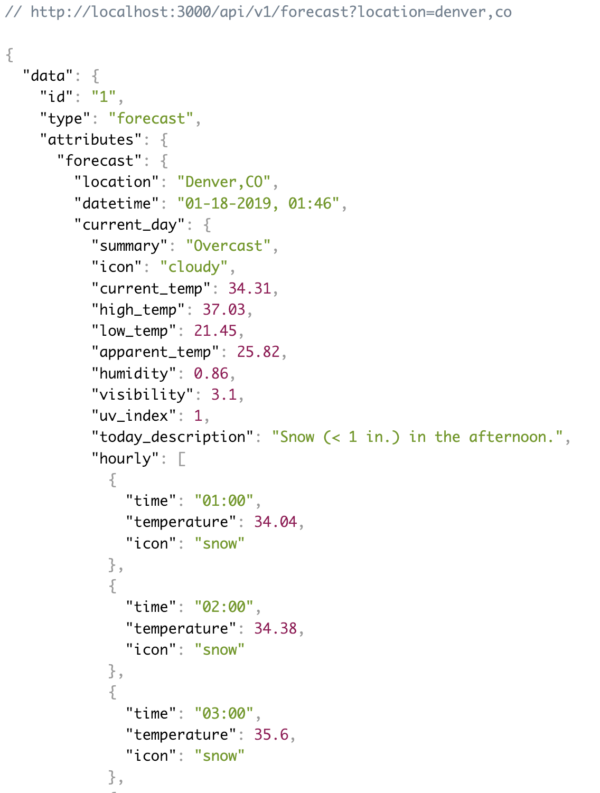
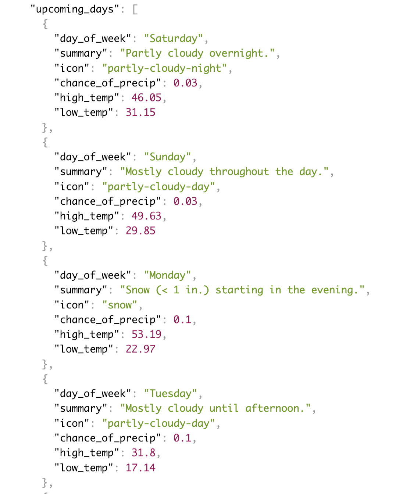
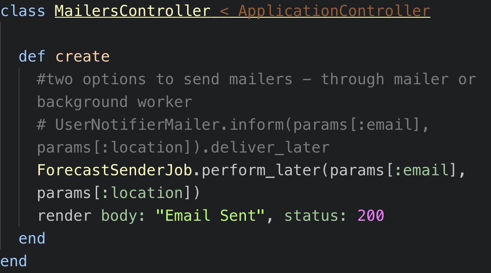

# README - Sweater Weather - https://thawing-basin-85011.herokuapp.com

Sweater Weather is a Rails application that provides and consumes a variety of APIs.  The APIs consumed include Google Geocode and Dark Sky API.  

The endpoints provided are -
* get /api/v1/forecast?location=denver,co
* post /api/v1/users?email=sample&password=test&password_confirmation=test
* post /api/v1/sessions?email=sample@email.com&password=test
* post /api/v1/favorites?location=denver,co&api_key=abc123
* get /api/v1/favorites?api_key=abc123
* post /mailers?email=email&location=denver,co

For those endpoints that require an api_key:
You can retrieve your user application api_key after posting your email, password and password confirmation through the post /api/v1/users endpoint.  

Here is a sample response to the get forecast endpoint:

Sweater Weather utilizes a postgresql database and will eventually utilize Javascript for the front-end design of the application.

Sweater Weather also has functionality to email the contents of a forecast to a user via the post /mailers endpoint.  The application has built-in capability to either send the email straight through Active Mailer or through a Background Worker.  The app utilizes Sendgrid, redis and sidekiq for this functionality.  See setup instructions below.

## Getting Started

These instructions will get you a copy of the project up and running on your local machine for development and testing purposes.

From GitHub clone down repository using the following commands in terminal:
* git clone git@github.com:bdiveley/sweater_weather.git
* cd sweater_weather

### Prerequisites

Thriftr was developed in Rails 5.2 and so we recommend using the same or a more current version of Rails.  The Ruby version used is 2.4

To check your version using terminal run: rails -v in the command line. (use ruby -v to retrieve the ruby version)

If you have not installed rails, in terminal run: gem install rails -v 5.2 in the command line.

### Installing

Open terminal and run these commands:
* bundle
* rake db:{drop,create,migrate}
* rails s (this will open the server to look at the program in development)
* To setup for sending emails via the background worker, run these commands from your terminal:
  * brew update
  * brew install redis
  * Open up a new tab and run 'redis-server'
  * Open up a new tab and run 'bundle exec sidekiq'
  * in total, you should have three terminal tabs open - one for the localhost server, one for redis and the last for sidekiq

* Open up a web browser (preferably Chrome)

* Navigate to localhost:3000 and add on any endpoint you wish to view, such as 'localhost:3000/forecast?location=denver,co'.  If you wish to visit any of the post endpoints, you will need to utilize a different resource other than your browser, such as PostMan. Browsers are only capable of making get requests for web pages.  You will need to send a post request to gain access to your api_key.  https://www.getpostman.com/

### API_KEYS
In order to full utilize the functionality of this app, you must create accounts for and sign up to receive a number of API Keys.

*Google_API - https://developers.google.com/places/web-service/get-api-key
*Darksky_API - https://darksky.net/dev

Once you receive each of these keys, follow these steps to add them to your Sweater Weather application:

From the terminal run - figaro install
This will create a hidden file in config/application.yml
Within this hidden file, add your new API keys using the following format:
*GOOGLE_API_KEY: google_api_key_goes_here
*DARKSKY_API_KEY: darksky_api_key_goes_here

## Running the tests

* Note: Before running RSpec, ensure you're in the project root directory.

From the terminal run: rspec

After RSpec has completed, you should see all tests passing as GREEN.  Any tests that have failed or thrown an error will display RED.  Any tests that have been skipped will be displayed as YELLOW.

## Built With

* Rails
* Google API
* DarkSky API
* RSpec
* ShouldaMatchers
* Capybara
* Launchy
* Pry
* SimpleCov
* FactoryBot
* BCrypt
* PostreSQL

## Authors

* Bailey Diveley - Github: BDiveley
